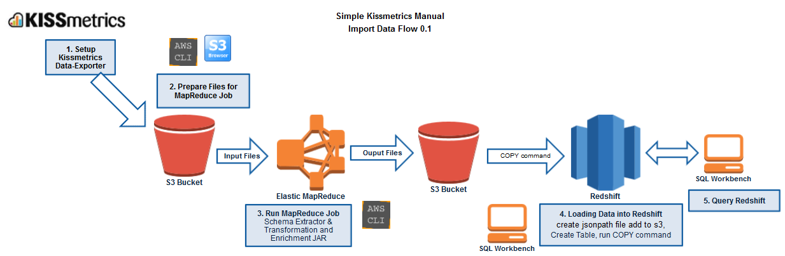

Copyright (c) 2014-2015 Giving.com, trading as JustGiving or its affiliates. All Rights Reserved.

Licensed under the Apache License, Version 2.0 (the "License"). You may not use this file except in compliance with the License. A copy of the License is located in the "license" file accompanying this file. This file is distributed on an "AS IS" BASIS, WITHOUT WARRANTIES OR CONDITIONS OF ANY KIND, either express or implied. See the License for the specific language governing permissions and limitations under the License.

# KISSmetrics JSON parser and schema extractor on Elastic MapReduce for Redshift

This project allows you to transform and enrich a massive number of KISSmetrics JSON files into a suitable format that can be directly imported into Redshift. To scale linearly, it uses a YARN MapReduce job that runs on an Amazon Web Services (AWS) Elastic MapReduce (EMR) cluster. The MapReduce source code, detailed steps, and lessons learnt from our experience of processing with billions of KISSmetrics web events are provided here.

KISSmetrics is a web analytics application that tracks users' activity on a website. It's similar to Google Analytics but allows you to easily retrieve user level raw click streams data. 

It offers a business friendly web user interface but there are limitations in terms of running big queries and joining user events to the internal data. Loading the data into a massively parallel processing database such as AWS Redshift allows you to query the data using SQL. Redshift is fully managed by AWS and can scale out to support SQL on a petabyte of data. It also natively integrates with other tools such as Tableau for visualisation, or any other JDBC, ODBC or PostgreSQL driver compatible systems, e.g. you can query Redshift for data science experiments using R or Python. However Redshift requires the data to be structured and relatively clean data.

KISSmetrics has an easy to setup JSON export process that regularly writes files to an [Simple Storage Service (S3) bucket](http://aws.amazon.com/s3/). However some transformation and enrichment on the data is required, before it can be loaded into Redshift, e.g. tasks such as character conversions, date formatting, mobile application exceptions and assigning fields to correct columns.

## Use of EMR in the JustGiving RAVEN platform


RAVEN is an adaptable AWS cloud computing event-driven platform that supports evolving reporting and ad-hoc analytic requirements at JustGiving. We are making use of KISSmetrics for client side web analytics, and with the limitations of the KISSmetrics web user interface, requirement to join the records to transactional data, and need to run complex queries, we decided that we needed to import the data in to Redshift. We have an automated process that regularly runs AWS EMR jobs that parses and enriches the latest KISSmetrics JSON records and loads the output into Redshift.

In our data science team, we have been using EMR and Redshift for their flexibility and scalability. EMR is a managed Apache Hadoop framework that has allowed us to run large automated Extract Transform and Load (ETL), and analytics processes on terabytes of data, quickly and without worrying about the infrastructure setup and maintenance behind the cluster. This Java project is one of the key components that we are sharing. It allows you to run ETL at scale on KISSmetrics data, shows how MapReduce Unit (MRUnit) works and can be used as a foundations for more complex tasks such a complex data joins, web click stream anaytics and backdating historical data.

## Purpose

This Java project offers two main functions:

1.  Analysis of the KISSmetrics JSON files, by counting the keys in all JSON files and also the maximum length of the values - this output is useful to help build up a Redshift table schema and detect any new fields.
2.  Parse and enrich the KISSmetrics JSON records so that they can be loaded into Redshift.

For smaller datasets, the code can be executed locally. For larger datasets > 50GB it can be ran as a MapReduce job on an EMR cluster. The project has been written in Java for the flexibility of the JSON libraries, to make use of the low level features available in MapReduce and for the MapReduce UnitTests framework [MRUnit](https://mrunit.apache.org/). The current setup builds a *fat JAR* which includes all the libraries it needs in the package. The code has been tested on billions of KISSmetrics events, but we cannot accept any liability and please use it at your own risk.

This document assumes that the user is familiar with KISSmetrics, MapReduce, S3, EMR, AWS Command Line Interface (CLI) and the AWS console, and they want to parse and import a large set of KISSmetrics records into Redshift. It puts a focus on the AWS CLI for the one line commands and repeatability over the Console which relies on the user interface.

## KISSmetrics to EMR and import into Redshift workflow

* For developers: this document assumes that the user is familiar with KISSmetrics, [Java](https://www.oracle.com/java/), [Maven](http://maven.apache.org/), [AWS](http://aws.amazon.com/), [Redshift](http://aws.amazon.com/redshift/), and [MapReduce](http://hadoop.apache.org/). To Build the JAR Java, Maven Needs to be setup locally
* For non-developers: this document provides a pre-built JAR so they can skip the Maven Java build process and run the JAR directly from the AWS CLI or Console. To run it locally, Java will need to be installed.

Here is a simple manual workflow we will now go over in detail:


## 1. Setup KISSmetrics Data Exporter

### Setup KISSmetrics to write to S3

* KISSmetrics documentation describes how to setup the [automated data export to S3](http://support.kissmetrics.com/apis/data/data-export-setup)
* Currently the frequency depends on the data volumes, for us this happens roughly every hour.

### The KISSmetrics input data format
The KISSmetrics data format is stored as JSON records, where each line is a single valid JSON. It looks like this:
```
{"_p":"john", "_t":1234567890, "_n":"Visited Site", "url":"http://mysite.com", "campaign name":"my campaign"}
```
The underscore indicate system fields. *_p* and *_p2* can interchangeably  contain the email address  and unique ID.

More details on the data format and examples can be found on their [website](http://support.kissmetrics.com/apis/data/)

### Data transformation for Redshift
Here are some of the issues that were observed when importing the JSON records in the 3rd quarter of 2014, so it is possible that some have been fixed:
* Need to ensure that the data in encoded in UTF-8, e.g. some non-Latin character are passed though
* The JSON needs to be escaped correctly
* Some characters are encoded as Octal characters, e.g. `\\302\\243` is a `£` symbol

In addition the data needs to be enriched before being imported into Redshift:
* Redshift needs the date in format `'MM.DD.YYYY HH:MI:SS'`
* Its preferential to have the KISSmetrics email and ID in dedicated columns
* Its preferential to know which file the JSON originated from, very useful or debugging, e.g. we could know that the records in Redshift comes from the file 2325.JSON from a particular S3 bucket
* Dealing with events from mobile application. These use device time rather than KISSmetrics server time by default

The Java EMR JAR addresses all of these issues and requirements.

## 2. Prepare Files for MapReduce Job

### Data preparation

MapReduce requires a virtual folder in S3 to contain the source KISSmetrics JSON files that will be process, and also an output virtual folder that does not currently exist. To prepare the input files tools like S3Browser or AWS CLI can be used, or if you want to run the EMR job on all files you can use the S3 path to the revisions virtual folder, e.g. `s3://myjgbucket/revisions`. If the output folder already exists then please delete it or point the output S3 path to a new non-existent location.

The next step describes the JAR build process, if you do not want to build the JAR you can use the example JAR called `open-raven-kissmetrics-parser-1.0.jar` that is provided in the `\lib` folder

## 3. Running the MapReduce Job

### Running the unit tests and build the JAR with Maven (Developer step)
The full Java source code is provided along with MRUnit Tests.

Apache Maven is a build manager for Java projects. It is the recommended way to generate the JAR files for the local execution and MapReduce step on EMR.
Please configure the `pom.xml` file depending on requirements. Run the following Maven command to run the Unit Tests and build the JAR.
```
mvn package
```

### Running the JAR in local mode

Running the code in local mode allows you to analyse smaller datasets without the need to launch a EMR cluster. Note that Java will have to be installed and the KISSmetrics data will have to be downloaded from S3. If you want log to the console and/or create log files, please ensure that the `log4j.properties` file is in the same directory as the JAR file. These are useful for debugging and monitoring the process.

#### 1. Run the JSON key row counter and maximum value code:

The following can be ran from command prompt:
```
java -cp open-raven-kissmetrics-parser-1.0.jar  com.justgiving.raven.kissmetrics.utils.KissmetricsLocalSchemaExtractor D:\datasets\kissmetrics\input5\  D:\datasets\kissmetrics\output5\schema.txt
```
Usage: the parameters are `<main class> <input folder> <schema file output path>`

The output will look something like the following, the first column is the key, the second column is the total number of rows with that key, and the third is the maximum length of the value for that key.
```
_c	3119	10
_n	2575554	25
_p	2928433	51
[...]
```
For example in the above the key *_n* occurred in 2,575,554 rows and its maximum size was 25. This extraction process is extremely useful and quick way to help create a schema in Redshift. When loading any data into Redshift the size and data type of each column needs to be predefined, so it is useful to know if a column will be populated and also the maximum size. For the size it is possible to truncate values so they fit within the column using the option  `TRUNCATECOLUMNS` when the data is loaded, however it is also useful to know this value to optimise the table sizes.

#### 2. Run the transformation and enrichment:

Run the following command to parse and enrich the JSON files into a format that can be directly imported into Redshift
```
java -cp open-raven-kissmetrics-parser-1.0.jar  com.justgiving.raven.kissmetrics.utils.KissmetricsRowParser D:\datasets\kissmetrics\input5\  D:\datasets\kissmetrics\output5a\
```
Usage: the parameters are `<main class> <input folder> <output folder>`

### Running the JAR as an AWS Elastic MapReduce Step

Once sufficient KISSmetrics data has been collected in S3, it makes more sense to run a scalable MapReduce job to transform it to the Redshift format:
 1.  Install the AWS CLI URL (http://aws.amazon.com/cli/) and setup your keys with [`aws configure`](http://docs.aws.amazon.com/cli/latest/userguide/cli-chap-getting-started.html)
 2.  Prepare a source folder in S3 with all the kissmetrics files that you want to transform. By default Kissmetrics drops the files under `s3://KISSMETRICS_TARGET_BUCKET/revisions/` We recommend using a tool like S3Browser or AWS CLI to copy the file to another bucket. For example you could copy all JSON files to the following location `s3://MY_BUCKET/kissmetrics/json/` the examples below assume the bucket is `s3://myjgbucket`
 3.  Upload the `open-raven-kissmetrics-parser-1.0.jar` to an S3 bucket, e.g. `s3://myjgbucket/source/java/lib/open-raven-kissmetrics-parser-1.0.jar` so that this is available as a Step in the EMR job
 4.  Run the AWS CLI using command, note that the output folder must not already exist otherwise the job will fail.

 The details can be found [here](http://docs.aws.amazon.com/cli/latest/reference/emr/create-cluster.html)

#### Example KISSmetrics JSON Records Schema Extraction at scale
`
aws emr create-cluster --steps  Type=CUSTOM_JAR,Name=CustomJAR,ActionOnFailure=TERMINATE_JOB_FLOW,Jar=s3://myjgbucket/source/java/lib/open-raven-kissmetrics-parser-1.0.jar,MainClass=com.justgiving.raven.kissmetrics.schema.KissmetricsJsonToSchemaDriver,Args=s3://myjgbucket/data/kissmetrics/json,s3://myjgbucket/data/kissmetrics/schema-out,5  --ami-version 3.8.0 --instance-groups InstanceGroupType=MASTER,InstanceCount=1,InstanceType=m3.xlarge InstanceGroupType=CORE,InstanceCount=2,InstanceType=m3.xlarge --auto-terminate --region eu-west-1 --enable-debugging --log-uri s3://myjgbucket/emr_logs --name emr-kissmetrics-schema-extraction --tags Name=poc-KISSmetrics-Node --use-default-roles --ec2-attributes KeyName=myKey 
`

* `myKey` is the name of the AWS Key used to SSH to the master node
* Increase the `InstanceCount` and `InstanceType` if you want more EC2 instances or larger nodes to process the data
* Modify the input parameters `Args=` for your data. The `open-raven-kissmetrics-parser-1.0.jar` JAR parameters are `<main class> <input path> <output path> <number of reducers>`

You will get back a `ClusterId = j-XXXXXXXX` back from the command. Note that the output folder must not already exist otherwise the job will fail.

#### Example KISSmetrics JSON Records Transformation and Enrichment for Redshift at scale
`
aws emr create-cluster --steps  Type=CUSTOM_JAR,Name=CustomJAR,ActionOnFailure=TERMINATE_JOB_FLOW,Jar=s3://myjgbucket/source/java/lib/open-raven-kissmetrics-parser-1.0.jar,MainClass=com.justgiving.raven.kissmetrics.jsonenricher.KissmetricsJsonToEnrichedJsonDriver,Args=s3://myjgbucket/data/kissmetrics/json,s3://myjgbucket/data/kissmetrics/json-out,5  --ami-version 3.8.0 --instance-groups InstanceGroupType=MASTER,InstanceCount=1,InstanceType=m3.xlarge InstanceGroupType=CORE,InstanceCount=2,InstanceType=m3.xlarge --auto-terminate --region eu-west-1 --enable-debugging --log-uri s3://myjgbucket/emr_logs --name emr-kissmetrics-parsing --tags Name=poc-KISSmetrics-Node --use-default-roles --ec2-attributes KeyName=myKey
`

* myKey is the name of the AWS Key used to SSH to the master node
* Increase the `InstanceCount` and `InstanceType` if you want more EC2 instances or larger nodes to process the data
* Modify the input parameters `Args=` for your data. The `open-raven-kissmetrics-parser-1.0.jar` JAR parameters are `<main class> <input path> <output path> <number of reducers>`

You will get back a `ClusterId = j-XXXXXXXX` back from the command. Note that the output folder must not already exist otherwise the job will fail.

#### Monitor the progress in AWS Console or via a command like

Use the following command to see the status of the cluster. When the step has completed, the cluster will automatically terminate and data will be available in the output S3 virtual folder.
```
aws emr describe-cluster --cluster-id j-XXXXXXXX
```
In the AWS Console (or raw log files) you can also monitor the number of records that pass through the MapReduce process. We have created a set of custom counter. These can be viewed in the CustomJAR > syslog. Here is an example extract:
```
Map-Reduce Framework
		Map input records=214042
		Map output records=214042
		[...]
		Reduce input records=214042
		Reduce output records=214042
		[...]
	com.justgiving.raven.kissmetrics.KissmetricsConstants$TRACKING_COUNTER
		VALID_JSON_ROW=214042
```
Counters are a MapReduce feature that allows you to count different events, they are very useful to see if any records are dropped by the mappers or reducers. Here we can see that no records are dropped as 214,042 is consistent. `VALID_JSON_ROW` is a custom counter that also validates this.


#### Running the JAR Step in the AWS Console (Optional)

It is possible to do run a KISSmetrics enrichment and transformation in EMR using the Web UI only. First create an EMR cluster or go to an existing one, once it is waiting state press *add step*, select *step type custom JAR*.

For the KISSmetrics schema extraction use:
```
Name: KISSmetrics JSON Records Schema Extraction
JAR location: s3://myjgbucket/source/java/lib/open-raven-kissmetrics-parser-1.0.jar
Arguments: com.justgiving.raven.kissmetrics.schema.KissmetricsJsonToSchemaDriver s3://myjgbucket/data/kissmetrics/json s3://myjgbucket/data/kissmetrics/json-schema-out 10
Action on failure: Continue
```

For the KISSmetrics JSON Records Transformation and Enrichment for Redshift:
```
Name: KISSmetrics JSON Records Transformation and Enrichment
JAR location: s3://myjgbucket/source/java/lib/open-raven-kissmetrics-parser-1.0.jar
Arguments: com.justgiving.raven.kissmetrics.jsonenricher.KissmetricsJsonToEnrichedJsonDriver s3://myjgbucket/data/kissmetrics/json s3://myjgbucket/data/kissmetrics/json-out2 10
Action on failure: Continue
```


## 4. Loading the data into Redshift

### 1. Setup and install SQL Redshift Client

[SQL Workbench](http://docs.aws.amazon.com/redshift/latest/mgmt/connecting-using-workbench.html) to connect to Redshift, other options are available

### 2. Create the JSONPaths 
Redshift `COPY` uses a `JSONPaths` file to parse the JSON source data. The creation of the file can be scripted based on the JSON Records Schema Extraction MapReduce job. 
For example a simple JSON path schema could look like:

```
{
	"jsonpaths": [
		"$['km_timestamp']",
		"$['event']",
		"$['user_email']",		
		"$['user_km_id']",
		"$['event_timedate']",
		"$['referrer']",
		"$['url']",
		"$['user_agent']",
		"$['user_language']",
		"$['filename']"		
	]
}
```
This file is provided under the `/schema` folder and needs to be uploaded into S3, so that Redshift can use it during the `COPY` command.

For more detail on the [COPY usage](http://docs.aws.amazon.com/redshift/latest/dg/copy-usage_notes-copy-from-json.html)


### 3. Create the table in Redshift. 

For example a simple unoptimised table could look like:
```
DROP TABLE if exists example_kissmetrics;
CREATE TABLE example_kissmetrics
(
	km_timestamp	varchar(255),
	event	varchar(255),
	user_email	varchar(255),
	user_km_id	varchar(255),
	event_timedate	timestamp,
	referrer	varchar(3050),	
	url	varchar(3050),
	user_agent	varchar(3050),
	filename	varchar(255)
)
```

### 4. Run a COPY command to run a parallel import of the data into Redshift:
```
COPY example_kissmetrics  from 's3://myjgbucket/data/kissmetrics/json-out/part'
credentials 'aws_access_key_id=PUT_ACCESS_KEY_HERE;aws_secret_access_key=PUT_SECRET_ACCESS_KEY_HERE'
json 's3://myjgbucket/source/schema/kissmetrics_object_schema.txt' timeformat 'YYYY-MM-DD HH:MI:SS' TRIMBLANKS TRUNCATECOLUMNS ACCEPTINVCHARS ' ';
```
We found that including the `part` avoids having loading issues, it basically tells Redshift to load any files in the folder `output` with prefix `part`.

SQL workbench will give you a message like:
```
Warnings:
Load into table 'example_kissmetrics' completed, 214042 record(s) loaded successfully.

0 row(s) affected.
copy executed successfully

Execution time: 5.29s
```

### 5. Explore the loaded KISSmetrics data
```
Select top 1000 * from example_kissmetrics
```
Well done, you have successfully loaded KISSmetrics data into Redshift! 

## Where to go from here 

Load your transactional data from your data warehouse and run a join by email address, think about ETL automation and click stream analytics.

Please contact Richard Freeman by email at JustGiving.com for any feedback or comments. See [Richard Freeman's website](http://www.rfreeman.net) for his blog and research articles.

License

Copyright (c) 2014-2015 Giving.com, trading as JustGiving. Licensed under the Apache License (v2.0).